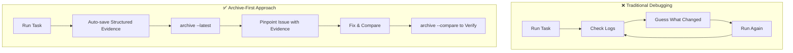
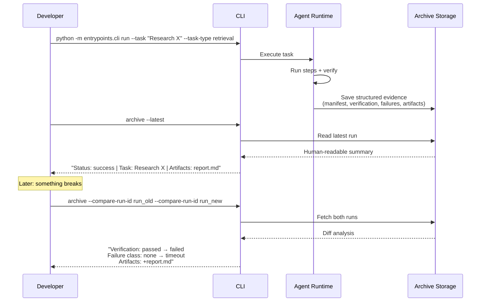
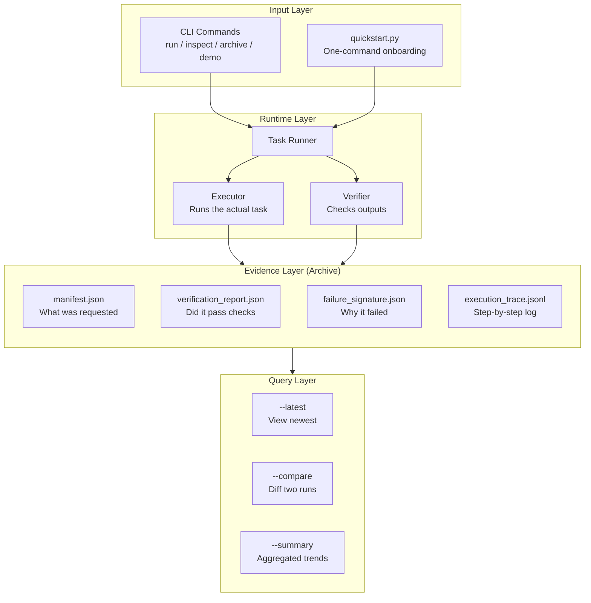
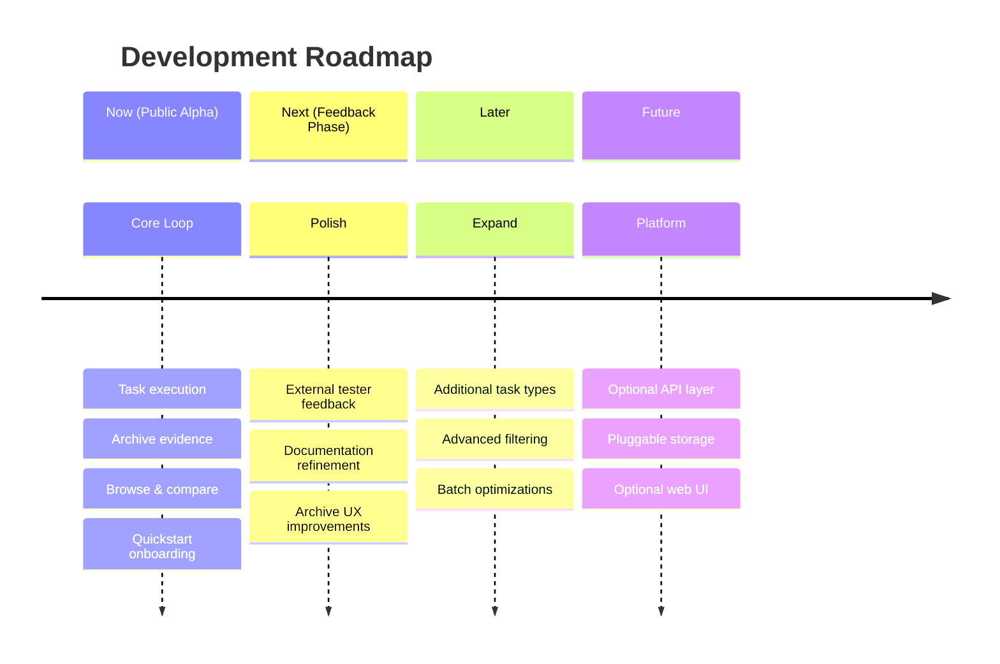

# archive-first-harness

<div align="center">

**Debug AI agent runs with evidence, not guesswork.**

[](https://www.python.org/)
[](#current-status)
[](#validation)

[**中文文档**](README.zh-CN.md) | [English](README.md)

</div>

---

## What This Does

**See exactly what your AI agent did and why—without digging through raw logs.**

When your AI agent runs a task, this tool automatically captures a structured record of:
- What input was given
- How it was executed step by step  
- Whether verification passed or failed
- What artifacts were produced
- Where and why it failed (if it did)

You can then:
- **Browse** the latest run with a human-readable summary
- **Compare** two runs to see exactly what changed
- **Filter** runs by task type, status, or failure class

Think of it as a **flight recorder for AI agents**: lightweight, always on, and designed for debugging real issues rather than polishing demos.



---

## Quick Start (30 seconds)

### Prerequisites
- Python 3.13+ installed
- Git

### Run This

```bash
git clone https://github.com/quzhiii/archive-first-harness.git
cd archive-first-harness
python quickstart.py
```

**What happens:**
1. Checks system state
2. Runs a minimal "ping" task  
3. Shows you a readable summary of what just happened

That's it. No setup, no dependencies, no configuration.

### Try the Demo

```bash
python -m entrypoints.cli demo
```

Creates two sample runs (success + failure) so you can immediately try the comparison feature:

```bash
python -m entrypoints.cli archive --compare-run-id demo_success_ping --compare-run-id demo_failure_guardrail
```

---

## Real-World Usage Pattern

Here's how you actually use this in practice:



### Common Commands

```bash
# Run a task
python -m entrypoints.cli run --task "Summarize this article" --task-type retrieval

# View the latest run (human readable)
python -m entrypoints.cli archive --latest

# Find a specific run
python -m entrypoints.cli archive --run-id 20260411T133512Z_ping_3eef61

# Compare two runs
python -m entrypoints.cli archive --compare-run-id <id1> --compare-run-id <id2>

# View trends across filtered runs
python -m entrypoints.cli archive --summary --task-type retrieval
```

---

## Why This Exists

Most AI agent systems look great in demos but become painful in production:

| Problem | Why It Matters |
|---------|---------------|
| "It worked yesterday, what's different now?" | Without comparison, debugging is guesswork |
| "The logs say it succeeded, but where's the output?" | Success without artifacts is failure in disguise |
| "Something failed, but where?" | You need to know: routing? execution? verification? |

**This tool makes these questions answerable.**

Every run produces structured evidence you can query, compare, and act on—instead of scrolling through unstructured logs hoping to spot the difference.

---

## How It Works (Architecture)



**Key design principles:**

1. **Archive-first**: Evidence is a first-class output, not an afterthought
2. **Conservative runtime**: The execution path stays narrow and diagnosable
3. **No hidden control flow**: Evaluation and comparison don't silently change how things run
4. **Standard library only**: Zero runtime dependencies for the core system

---

## Current Status

**Public Alpha** – Core functionality is solid, onboarding is actively improving.

### What's Working

- ✅ Single-task CLI execution
- ✅ Sequential batch execution  
- ✅ Automatic per-run archival with structured evidence
- ✅ Browse: latest run, specific run ID, filtered lists
- ✅ Compare: side-by-side diff of any two runs
- ✅ Summary: aggregate trends across runs
- ✅ 291 tests passing
- ✅ Verified on real tasks: success, failure, governance review, coding artifacts

### What's Not Here Yet

- ❌ Web UI (use CLI for now)
- ❌ Database backend (filesystem only)
- ❌ Async workers (sequential execution)
- ❌ Hosted service (local tool)

These are intentionally delayed until the core archive loop is proven in real use.

---

## Who Should Use This

**Good fit if you:**
- Build AI agents and need to debug why runs fail or behave differently
- Want run-level evidence before building bigger infrastructure
- Care more about "can I explain what happened" than "does it look impressive"
- Prefer tools that do one thing well over platforms that do everything

**Not a fit if you:**
- Need a complete end-user product today
- Want a hosted API service
- Require enterprise features (auth, multi-tenant, etc.)

---

## Project Roadmap



Near-term priorities are concrete:

1. **Reduce first-run friction** ← you are here
2. Collect public alpha feedback
3. Improve archive signal-to-noise ratio
4. Accumulate real usage patterns
5. Keep runtime boundary stable until usage proves the archive loop

---

## Documentation

- [Quick Start Guide](docs/2026-04-02-external-uat-quickstart.md) – Step-by-step first run
- [Tester Feedback Checklist](docs/2026-04-12-external-feedback-checklist.md) – What to look for when testing
- [Architecture & Roadmap](PROJECT_ARCHITECTURE_STATUS_AND_ROADMAP.md) – Deep dive
- [Real Usage Diary Template](docs/2026-04-02-real-usage-diary-template.md) – Track your experience

---

## Feedback Welcome

Testing this? The most valuable feedback:

- Where did you get stuck?
- Which output was confusing?
- Did `compare` actually help you understand a difference?
- Would you use this in your actual workflow?

[Open an issue](https://github.com/quzhiii/archive-first-harness/issues) or reference the [feedback checklist](docs/2026-04-12-external-feedback-checklist.md).

---

<div align="center">

**[⬆ Back to Top](#archive-first-harness)**

</div>
