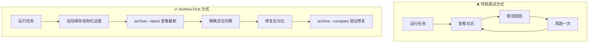
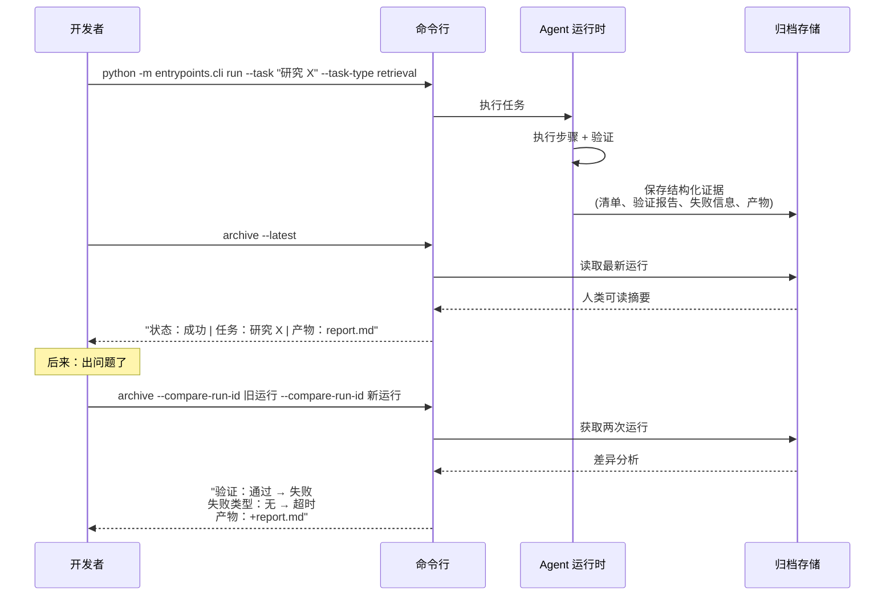
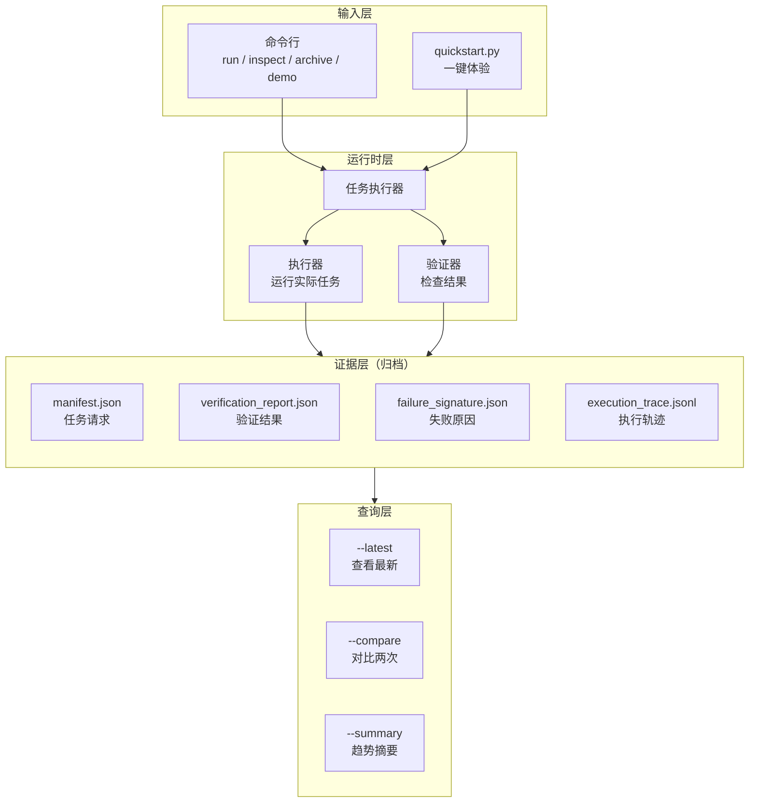
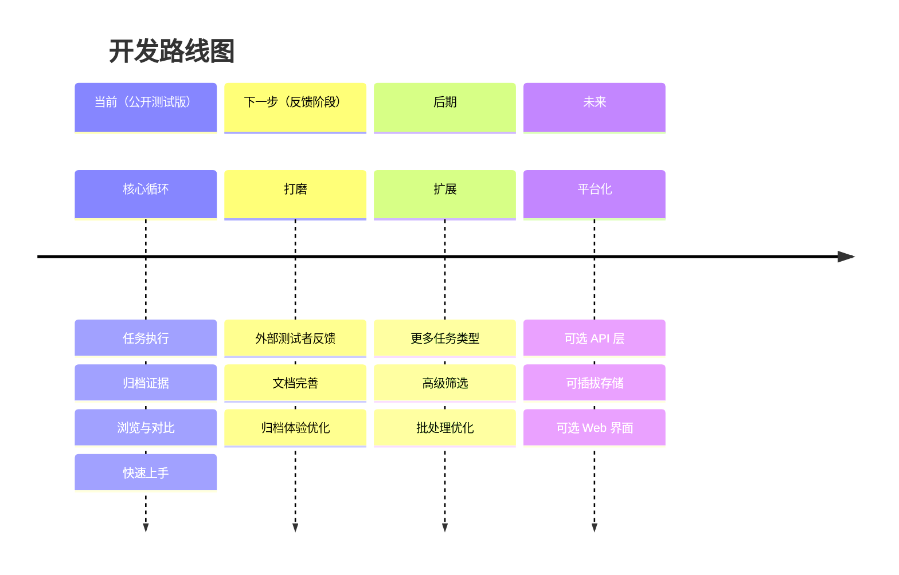

# archive-first-harness

<div align="center">

**用证据调试 AI Agent，而不是靠猜测。**

[](https://www.python.org/)
[](#当前状态)
[](#验证情况)

[中文文档](README.zh-CN.md) | [**English**](README.md)

</div>

---

## 这个工具能做什么

**清楚地看到 AI Agent 做了什么、为什么这么做——不用翻原始日志。**

当你的 AI Agent 运行任务时，这个工具会自动记录结构化的执行证据：
- 输入了什么任务
- 每一步是如何执行的
- 验证是通过还是失败
- 产生了哪些输出文件
- 在哪里、为什么失败（如果失败了）

然后你可以：
- **查看**最新一次运行的人类可读摘要
- **对比**两次运行，精确看到哪里变了
- **筛选**特定类型的运行（按任务类型、状态、失败类型等）

把它想象成 AI Agent 的**黑匣子**：轻量、始终开启、专为调试实际问题设计，而不是为了展示效果。



---

## 快速开始（30秒）

### 环境要求
- Python 3.13+
- Git

### 运行命令

```bash
git clone https://github.com/quzhiii/archive-first-harness.git
cd archive-first-harness
python quickstart.py
```

**会发生什么：**
1. 检查系统状态
2. 运行一个最简单的 "ping" 任务
3. 显示刚才运行的人类可读摘要

就这些。不需要配置，不需要安装依赖。

### 体验演示

```bash
python -m entrypoints.cli demo
```

这会创建两个示例运行（一个成功、一个失败），让你马上体验对比功能：

```bash
python -m entrypoints.cli archive --compare-run-id demo_success_ping --compare-run-id demo_failure_guardrail
```

---

## 实际使用场景

这是你在实际工作中会如何使用它：



### 常用命令

```bash
# 运行任务
python -m entrypoints.cli run --task "总结这篇文章" --task-type retrieval

# 查看最新运行（人类可读）
python -m entrypoints.cli archive --latest

# 查找特定运行
python -m entrypoints.cli archive --run-id 20260411T133512Z_ping_3eef61

# 对比两次运行
python -m entrypoints.cli archive --compare-run-id <id1> --compare-run-id <id2>

# 查看筛选后的趋势摘要
python -m entrypoints.cli archive --summary --task-type retrieval
```

---

## 为什么需要这个

大多数 AI Agent 系统在演示时效果很好，但生产环境调试很痛苦：

| 问题 | 为什么重要 |
|------|-----------|
| "昨天还能跑，今天怎么了？" | 没有对比能力，调试只能靠猜 |
| "日志说成功了，但输出在哪？" | 没有产物的成功其实是失败 |
| "哪里出错了？" | 需要知道：路由？执行？验证？ |

**这个工具让这些问题变得可回答。**

每次运行都会产生结构化证据，你可以查询、对比、采取行动——而不是在原始日志里找不同。

---

## 工作原理（架构）



**核心设计原则：**

1. **归档优先**：证据是一等公民，不是事后补充
2. **运行时保守**：执行路径保持精简、可诊断
3. **无隐藏控制流**：评估和对比不会悄悄改变运行方式
4. **仅标准库**：核心系统零运行时依赖

---

## 当前状态

**公开测试版（Public Alpha）** — 核心功能稳定，上手体验持续优化中。

### 已可用

- ✅ 单任务命令行执行
- ✅ 顺序批处理执行
- ✅ 自动归档每次运行的结构化证据
- ✅ 浏览：最新运行、指定 ID、筛选列表
- ✅ 对比：任意两次运行的并排差异
- ✅ 摘要：跨运行的聚合趋势
- ✅ 291 项测试通过
- ✅ 真实场景验证：成功、失败、治理审查、代码产物

### 尚未实现

- ❌ Web 界面（目前用命令行）
- ❌ 数据库后端（目前用文件系统）
- ❌ 异步工作器（目前顺序执行）
- ❌ 托管服务（本地工具）

这些是故意推迟的，直到核心归档流程在真实使用中得到验证。

---

## 适合谁用

**适合：**
- 构建 AI Agent 并需要调试运行失败或行为差异
- 希望在扩展基础设施前先落实运行级证据
- 更关心"我能否解释发生了什么"而不是"看起来是否 impressive"
- 喜欢把一件事做好的工具，而不是什么都做的平台

**不适合：**
- 需要一个完整终端产品的用户
- 想要托管 API 服务
- 需要企业功能（认证、多租户等）

---

## 项目路线图



近期优先事项：

1. **降低首次上手门槛** ← 当前阶段
2. 收集公开测试反馈
3. 提高归档信噪比
4. 积累真实使用模式
5. 在使用证明归档循环有效前，保持运行时边界稳定

---

## 文档

- [快速开始指南](docs/2026-04-02-external-uat-quickstart.md) – 一步步首次运行
- [测试者反馈清单](docs/2026-04-12-external-feedback-checklist.md) – 测试时注意什么
- [架构与路线图](PROJECT_ARCHITECTURE_STATUS_AND_ROADMAP.md) – 深入阅读
- [使用日记模板](docs/2026-04-02-real-usage-diary-template.md) – 记录你的体验

---

## 欢迎反馈

在测试这个工具？最有价值的反馈：

- 你在哪里卡住了？
- 哪些输出让你困惑？
- `compare` 真的帮助你理解差异了吗？
- 你会在实际工作中使用它吗？

[提交 Issue](https://github.com/quzhiii/archive-first-harness/issues) 或参考[反馈清单](docs/2026-04-12-external-feedback-checklist.md)。

---

<div align="center">

**[⬆ 回到顶部](#archive-first-harness)**

</div>
