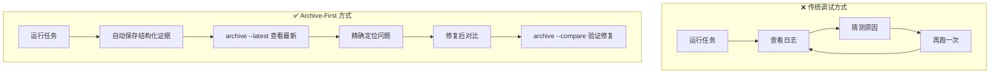
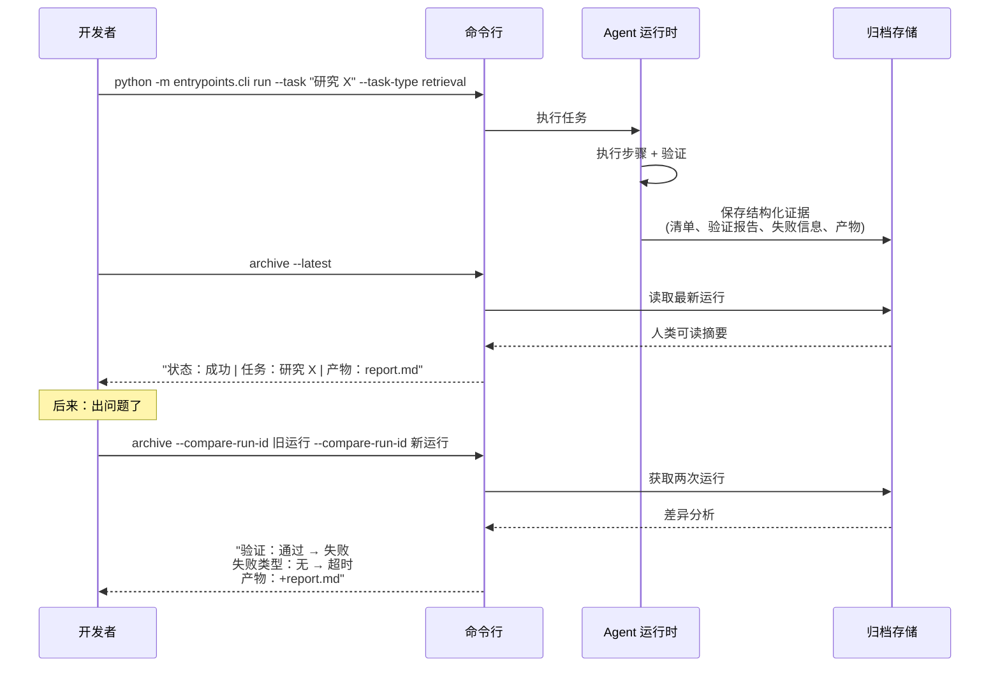
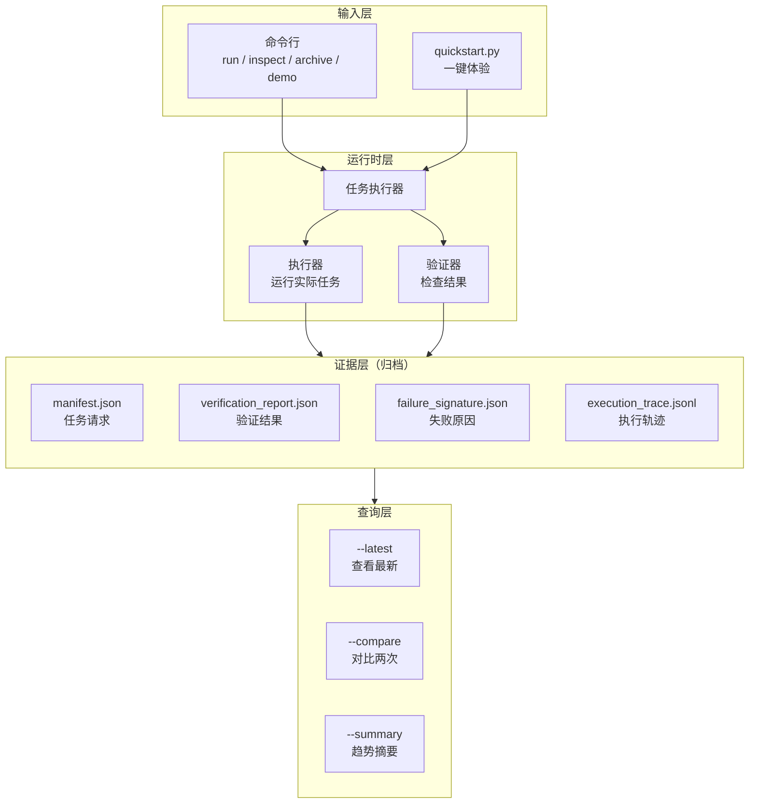
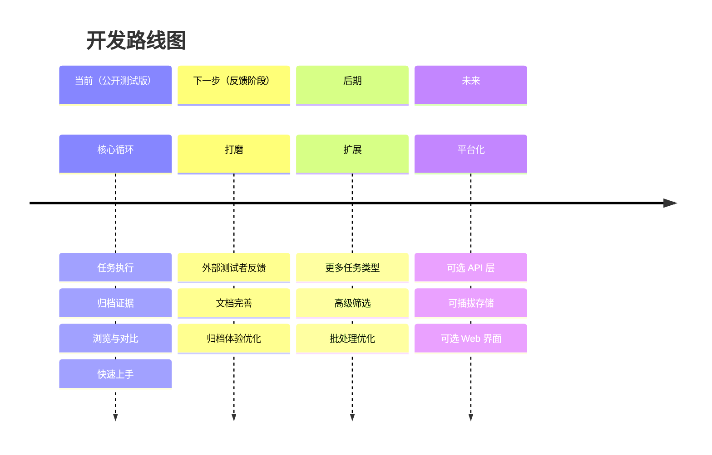

# archive-first-harness

<div align="center">

**Agent Evidence Layer — 调试 AI Agent 不靠猜，每次运行都有据可查。**

[](https://www.python.org/)
[](#当前状态)
[](#验证情况)

[中文文档](README.zh-CN.md) | [**English**](README.md)

</div>

---

## 这是什么

**AI Agent 技术栈缺失的第四层。**

当前 Agent 生态有三层：

```
┌────────────────────────────────────────┐
│  框架层      │  LangGraph, CrewAI      │  ← 构建 Agent
├────────────────────────────────────────┤
│  运行时层    │  OpenHands, Aider       │  ← 运行 Agent
├────────────────────────────────────────┤
│  可观测层    │  LangSmith, Langfuse    │  ← 追踪监控
├────────────────────────────────────────┤
│  证据层      │  archive-first-harness  │  ← 诊断对比 ← 就是这里
└────────────────────────────────────────┘
```

**框架层**帮你构建 Agent。**运行时层**提供执行环境。**可观测层**展示调用链。

但当你的 Agent 昨天能跑、今天挂了，你需要的是**第四层**：一个归档每次运行结构化证据、并能精确对比差异的系统。

这就是 **Evidence Layer（证据层）**：本地优先、零依赖、专为"哪里变了"而生。

---

## 解决的痛点

| 痛点 | 传统方式 | Archive-First |
|------|---------|---------------|
| 调试 Agent 失败 | 翻日志、猜原因、再重试 | 结构化归档，精确对比差异 |
| "昨天还能跑" | 不知道哪里变了 | `--compare` 并排看变化 |
| 失败定位 | 日志里找异常 | 失败类型、阶段自动分类 |
| 成功但无输出 | 以为成功了，其实没产物 | 验证报告检查预期产物 |
| 调优靠感觉 | 改参数碰运气 | 两次运行数据对比验证 |

---

## 30 秒上手

```bash
git clone https://github.com/quzhiii/archive-first-harness.git
cd archive-first-harness
python quickstart.py
```

**输出示例：**

```
archive-first-harness quickstart
================================
[1/3] inspect-state       → ok | 30 state files
[2/3] run ping            → success | run_id=20260412_143022_7a3f
[3/3] archive --latest    → verification=passed | artifacts=1 file

✅ 首次运行完成！试试：
   python -m entrypoints.cli demo
   python -m entrypoints.cli archive --summary
```

---

## 核心能力

### 1. 运行即归档

每次 `run` 自动保存结构化证据：

```
artifacts/runs/<run_id>/
├── manifest.json          # 任务请求、状态、时间
├── verification_report.json   # 验证结果、产物清单
├── failure_signature.json     # 失败类型、阶段、原因
├── execution_trace.jsonl      # 执行步骤日志
└── final_output.json          # 最终输出
```

### 2. 查看与对比

| 命令 | 用途 |
|------|------|
| `archive --latest` | 查看最新运行摘要 |
| `archive --run-id <id>` | 查看指定运行详情 |
| `archive --compare-run-id <id1> <id2>` | 对比两次运行差异 |
| `archive --summary` | 统计趋势（成功/失败分布） |
| `demo` | 创建示例数据用于体验对比 |

**对比输出示例：**

```
对比: run_20260412_143022 vs run_20260412_143045
================================================
状态:        success        →   failed
失败类型:    -              →   timeout
验证:        passed         →   failed
产物:        1 file         →   0 files
执行时间:    2.3s           →   30.0s (超时)
```

---

## 架构设计

### 分层结构

```
┌─────────────────────────────────────────┐
│  用户界面层  │  CLI (quickstart.py)      │
├─────────────────────────────────────────┤
│  运行时层    │  Task Runner → Executor   │
│              │  → Verifier               │
├─────────────────────────────────────────┤
│  证据层      │  manifest / verification  │
│  (Archive)   │  / failure / trace        │
├─────────────────────────────────────────┤
│  查询层      │  --latest / --compare     │
│              │  / --summary              │
└─────────────────────────────────────────┘
```

### 设计原则

1. **归档优先**：证据是一等公民，不是副产品
2. **运行时保守**：执行路径简单、可预测、不藏逻辑
3. **零依赖**：纯 Python 标准库，无外部包
4. **本地优先**：数据存在本地文件，完全可控

---

## 典型使用流程

```
日常开发                        问题排查
─────────────────────────────────────────────────
1. run 任务          →         发现异常
2. archive --latest  →         archive --compare 
   确认结果                      新旧对比
3. 继续开发          →         定位问题
                               修复后验证
```

### 场景示例

**场景：Agent 昨天能跑，今天超时**

```bash
# 找到昨天和今天的运行 ID
python -m entrypoints.cli archive --summary --status failed
# → 发现今天有 3 次 timeout

# 对比最近一次成功和失败
python -m entrypoints.cli archive \
  --compare-run-id 20260411_success \
  --compare-run-id 20260412_timeout

# 输出显示：
# - 任务输入相同
# - 执行步骤相同
# - 但执行时间从 2s → 30s (超时)
# → 结论：外部 API 响应变慢，需增加重试或调大超时
```

---

## 当前状态

**Public Alpha** — 核心功能稳定，正在收集使用反馈。

### 已可用 ✅

- 单任务 CLI 执行
- 自动归档（manifest/verification/failure/trace）
- 查看最新、指定 ID、筛选列表
- 两次运行并排对比（差异高亮）
- 趋势摘要统计
- 291 项测试通过
- Windows / Linux / macOS 验证

### 暂不可用 ❌

- Web 界面（CLI 优先）
- 数据库存储（文件系统足够）
- 异步队列（顺序执行足够）
- 托管服务（本地工具定位）

---

## 适用场景

**适合你，如果：**
- 你正在构建 AI Agent，需要调试失败原因
- 你想比较两次运行的差异，而不是靠记忆
- 你关心"运行是否有产物"，不只是"是否没报错"
- 你喜欢简单工具，而不是复杂平台

**不适合你，如果：**
- 你需要完整的终端用户产品
- 你想要托管 API 服务
- 你需要企业级功能（SSO、审计等）

---

## 开发路线

| 阶段 | 目标 | 状态 |
|------|------|------|
| v0.1 | 基础运行 + 归档 | ✅ 完成 |
| v0.2 | Browse + Compare 查询 | ✅ 完成 |
| v0.3 | Quickstart + Demo 体验 | ✅ 完成 |
| v0.4 | **收集外部反馈** | 🚧 当前 |
| v0.5 | Archive 信噪比优化 | 📋 计划 |
| v1.0 | 稳定版发布 | 📋 计划 |

---

## 参与测试

我们正在招募测试者！如果你愿意试用并反馈：

1. **快速体验**：`python quickstart.py`
2. **查看反馈清单**：[docs/2026-04-12-external-feedback-checklist.md](docs/2026-04-12-external-feedback-checklist.md)
3. **提交 Issue**：[GitHub Issues](https://github.com/quzhiii/archive-first-harness/issues)

**最有价值的反馈：**
- 在哪里卡住了？
- 哪些输出看不懂？
- 对比功能是否真的帮你定位了问题？

---

## 相关文档

- [快速开始指南](docs/2026-04-02-external-uat-quickstart.md) — 详细步骤
- [反馈清单](docs/2026-04-12-external-feedback-checklist.md) — 测试检查项
- [架构详情](docs/diagrams/architecture-overview.md) — 图表说明

---

<div align="center">

**[↑ 回到顶部](#archive-first-harness)**

</div>


---

## 这个工具能做什么

**清楚地看到 AI Agent 做了什么、为什么这么做——不用翻原始日志。**

当你的 AI Agent 运行任务时，这个工具会自动记录结构化的执行证据：
- 输入了什么任务
- 每一步是如何执行的
- 验证是通过还是失败
- 产生了哪些输出文件
- 在哪里、为什么失败（如果失败了）

然后你可以：
- **查看**最新一次运行的人类可读摘要
- **对比**两次运行，精确看到哪里变了
- **筛选**特定类型的运行（按任务类型、状态、失败类型等）

把它想象成 AI Agent 的**黑匣子**：轻量、始终开启、专为调试实际问题设计，而不是为了展示效果。



---

## 快速开始（30秒）

### 环境要求
- Python 3.13+
- Git

### 运行命令

```bash
git clone https://github.com/quzhiii/archive-first-harness.git
cd archive-first-harness
python quickstart.py
```

**会发生什么：**
1. 检查系统状态
2. 运行一个最简单的 "ping" 任务
3. 显示刚才运行的人类可读摘要

就这些。不需要配置，不需要安装依赖。

### 体验演示

```bash
python -m entrypoints.cli demo
```

这会创建两个示例运行（一个成功、一个失败），让你马上体验对比功能：

```bash
python -m entrypoints.cli archive --compare-run-id demo_success_ping --compare-run-id demo_failure_guardrail
```

---

## 实际使用场景

这是你在实际工作中会如何使用它：



### 常用命令

```bash
# 运行任务
python -m entrypoints.cli run --task "总结这篇文章" --task-type retrieval

# 查看最新运行（人类可读）
python -m entrypoints.cli archive --latest

# 查找特定运行
python -m entrypoints.cli archive --run-id 20260411T133512Z_ping_3eef61

# 对比两次运行
python -m entrypoints.cli archive --compare-run-id <id1> --compare-run-id <id2>

# 查看筛选后的趋势摘要
python -m entrypoints.cli archive --summary --task-type retrieval
```

---

## 为什么需要这个

大多数 AI Agent 系统在演示时效果很好，但生产环境调试很痛苦：

| 问题 | 为什么重要 |
|------|-----------|
| "昨天还能跑，今天怎么了？" | 没有对比能力，调试只能靠猜 |
| "日志说成功了，但输出在哪？" | 没有产物的成功其实是失败 |
| "哪里出错了？" | 需要知道：路由？执行？验证？ |

**这个工具让这些问题变得可回答。**

每次运行都会产生结构化证据，你可以查询、对比、采取行动——而不是在原始日志里找不同。

---

## 工作原理（架构）



**核心设计原则：**

1. **归档优先**：证据是一等公民，不是事后补充
2. **运行时保守**：执行路径保持精简、可诊断
3. **无隐藏控制流**：评估和对比不会悄悄改变运行方式
4. **仅标准库**：核心系统零运行时依赖

---

## 当前状态

**公开测试版（Public Alpha）** — 核心功能稳定，上手体验持续优化中。

### 已可用

- ✅ 单任务命令行执行
- ✅ 顺序批处理执行
- ✅ 自动归档每次运行的结构化证据
- ✅ 浏览：最新运行、指定 ID、筛选列表
- ✅ 对比：任意两次运行的并排差异
- ✅ 摘要：跨运行的聚合趋势
- ✅ 291 项测试通过
- ✅ 真实场景验证：成功、失败、治理审查、代码产物

### 尚未实现

- ❌ Web 界面（目前用命令行）
- ❌ 数据库后端（目前用文件系统）
- ❌ 异步工作器（目前顺序执行）
- ❌ 托管服务（本地工具）

这些是故意推迟的，直到核心归档流程在真实使用中得到验证。

---

## 适合谁用

**适合：**
- 构建 AI Agent 并需要调试运行失败或行为差异
- 希望在扩展基础设施前先落实运行级证据
- 更关心"我能否解释发生了什么"而不是"看起来是否 impressive"
- 喜欢把一件事做好的工具，而不是什么都做的平台

**不适合：**
- 需要一个完整终端产品的用户
- 想要托管 API 服务
- 需要企业功能（认证、多租户等）

---

## 项目路线图



近期优先事项：

1. **降低首次上手门槛** ← 当前阶段
2. 收集公开测试反馈
3. 提高归档信噪比
4. 积累真实使用模式
5. 在使用证明归档循环有效前，保持运行时边界稳定

---

## 文档

- [快速开始指南](docs/2026-04-02-external-uat-quickstart.md) – 一步步首次运行
- [测试者反馈清单](docs/2026-04-12-external-feedback-checklist.md) – 测试时注意什么
- [架构与路线图](PROJECT_ARCHITECTURE_STATUS_AND_ROADMAP.md) – 深入阅读
- [使用日记模板](docs/2026-04-02-real-usage-diary-template.md) – 记录你的体验

---

## 欢迎反馈

在测试这个工具？最有价值的反馈：

- 你在哪里卡住了？
- 哪些输出让你困惑？
- `compare` 真的帮助你理解差异了吗？
- 你会在实际工作中使用它吗？

[提交 Issue](https://github.com/quzhiii/archive-first-harness/issues) 或参考[反馈清单](docs/2026-04-12-external-feedback-checklist.md)。

---

<div align="center">

**[⬆ 回到顶部](#archive-first-harness)**

</div>
