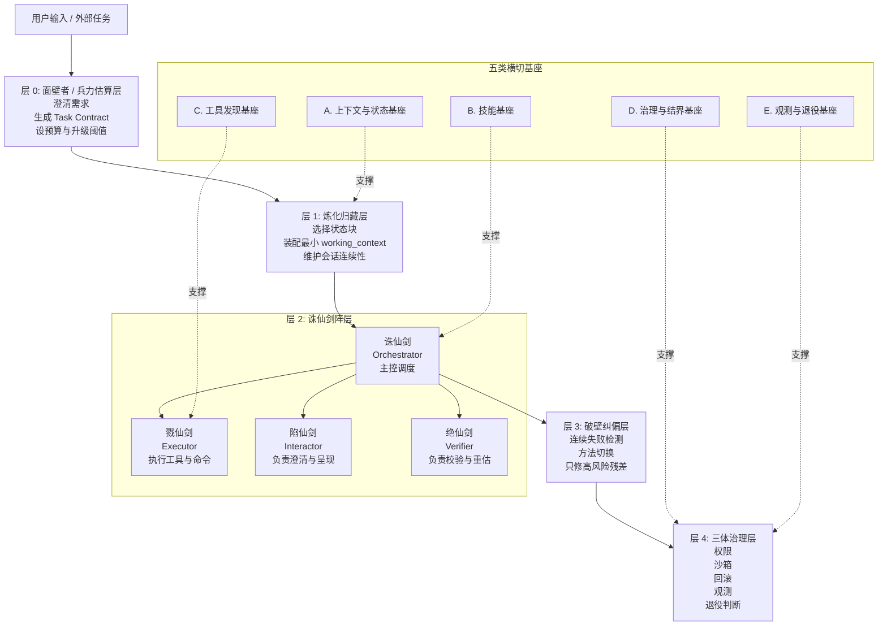
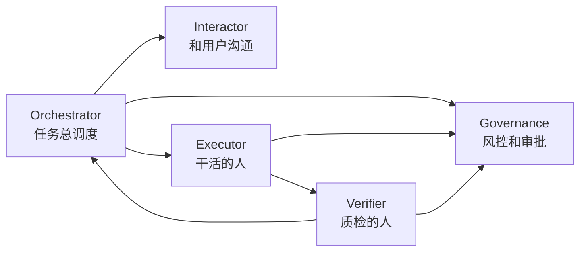
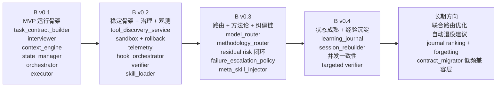
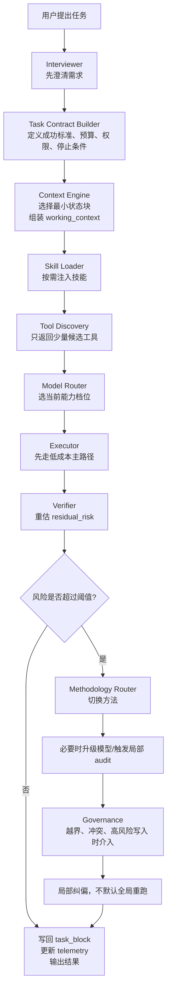

# Agent Paradigm A v1.4 图解白话版

## 1. 先用一句人话讲明白

这套架构要解决的，不是“模型够不够聪明”，而是“怎么让一个 Agent 系统在真实环境里别失控、别越跑越贵、别越做越乱”。

它的核心思路可以压缩成 6 句话：

1. 先把任务说清楚，再开始干。
2. 先只带必要上下文，不把全部历史都塞给模型。
3. 技能按需加载，工具按需暴露，不默认全量展开。
4. 默认先走低成本主路径，不是什么都上最强模型。
5. 如果结果还有高风险残差，只做局部纠偏，不默认全局重跑。
6. 每个后来加上的机制，都要能被统计、被比较、被删掉。

一句话总结：

> 这不是一个“更花哨的 Agent”，而是一套“让 Agent 可控、可解释、可降本、可治理”的运行骨架。

---

## 2. 这份文档到底在讲什么

这份 `A v1.4` 文档，本质上分成两层：

- `A`：定义一套架构语言和设计原则，先把边界和骨架定住。
- `B`：把这套骨架真正做成代码系统的落地路线图。

所以你可以把它理解成：

- `A` 负责回答“应该怎么设计”
- `B` 负责回答“应该先做哪些模块，按什么顺序做”

---

## 3. 它为什么要存在

作者判断，主流 Agent 系统常见 4 个病：

### 3.1 不可靠性税

一次失败，往往不是“再试一次”这么简单，而是会连带引出：

- 重试
- 校验
- 补救
- 人工接管
- 回滚

于是表面上看只是一次调用失败，实际上系统总成本会被拖得很高。

### 3.2 上下文腐化

真实系统里最耗 token 的，往往不是用户那一句话，而是这些东西：

- 聊天历史
- 工具定义
- 中间日志
- 检索结果
- 旧状态

如果这些内容一直堆在上下文里，模型会越来越“看不清重点”。

### 3.3 静态工具暴露悖论

如果一开始就把所有工具 schema 全塞进上下文：

- prompt 会越来越重
- 每轮都重复付相同的工具说明成本
- 模型更难选对工具
- 注意力会被工具说明书吃掉

### 3.4 模型过度使用

不是所有步骤都值得用最贵、最强的模型。

很多基础工作，本来就适合用：

- 低成本模型
- 确定性规则
- 更轻的执行器

所以这个架构的目标不是“永远最强”，而是“默认最省，必要时再升级”。

---

## 4. 架构框架图

这张图看的是“整套系统由哪些层组成”。

### 4.1 你可以怎么理解这 5 层

- 层 0：先问清楚“到底要干什么”
- 层 1：只拿当前任务真正需要的信息
- 层 2：开始执行，调度角色、技能、工具和模型
- 层 3：如果主路径不稳，就局部修，不全局乱跑
- 层 4：控制权限、隔离风险、统计成本、决定哪些模块以后可以删

---

## 5. 角色框架图

这张图看的是“执行层内部，谁负责什么”。

### 5.1 四把剑说人话

- `Orchestrator`：项目经理，负责分配和调度
- `Executor`：执行工，负责实际干活
- `Interactor`：前台，负责和用户继续确认需求、展示结果
- `Verifier`：质检，负责检查结果靠不靠谱
- `Governance`：风控/法务/审计，负责卡边界、做回滚、拦高风险动作

---

## 6. 技术路线图

这张图看的是“如果现在开始做 B 版，应该怎么一步步落地”。

### 6.1 这条路线怎么读

#### 第一步：先把最小主链跑起来

先不要急着做一大堆 fancy 机制。最先要做的是：

- 能问清任务
- 能生成任务契约
- 能管理状态
- 能开始执行

也就是先把“最小可运行骨架”搭起来。

#### 第二步：再补工具、沙箱、监控

系统能跑，不等于系统能上线。

下一步要补：

- 工具按需发现
- 沙箱与回滚
- telemetry 监控
- verifier

这一层的目标是让系统“稳定、可控、能追责”。

#### 第三步：再补智能路由和纠偏

等稳定骨架有了，才值得引入：

- model router
- methodology router
- failure escalation

因为这些模块会增加管理税，如果主骨架还没稳，越加越乱。

#### 第四步：最后做长期记忆和经验沉淀

比如：

- learning journal
- session rebuild
- 并发一致性
- 精细 verifier

这些都属于“锦上添花，但不该抢在主骨架前面做”的模块。

---

## 7. 运行流程图

这张图看的是“一次真实任务是怎么跑的”。

### 7.1 这个流程最关键的设计点

- 不是先执行，而是先立任务契约
- 不是先塞满上下文，而是先压缩成最小 working context
- 不是先把全部工具亮出来，而是先做 top-k 候选
- 不是默认上最强模型，而是先走低成本主路径
- 不是一有问题就全局重跑，而是 verifier 先判断残差风险，再决定是否局部纠偏

---

## 8. 模块对照表

如果你以后真要落地成代码，下面这张表最有用。

| 架构概念 | 说人话 | B 版建议代码位点 |
|---|---|---|
| 面壁者 / 兵力估算 | 任务澄清和开工前判断 | `planner/task_contract_builder.py` |
| Interviewer | 负责问清楚需求 | `planner/interviewer.py` |
| 任务契约 | 开工前的工单 | 契约 schema / builder |
| 炼化归藏层 | 状态仓库 + 上下文装配器 | `harness/context/context_engine.py` + `harness/state/state_manager.py` |
| Orchestrator | 总调度台 | `runtime/orchestrator.py` |
| Executor | 真正执行的人 | `runtime/executor.py` |
| Interactor | 前台沟通和结果呈现 | `runtime/interaction_adapter.py` |
| Verifier | 质检和风险重估 | `runtime/verifier.py` |
| Skills Registry | 方法库 / 工作流库 | `harness/skills/skill_loader.py` |
| Tool Discovery | 工具候选器 | `harness/tools/tool_discovery_service.py` |
| Model Router | 模型档位调度器 | `harness/runtime/model_router.py` |
| Methodology Router | 方法切换器 | `harness/governance/methodology_router.py` |
| Failure Escalation | 连续失败后的升级规则 | `harness/governance/failure_escalation_policy.py` |
| Governance | 风控、审批、回滚 | `harness/governance/` |
| Telemetry | 监控看板 | `harness/telemetry/` |
| Realm Evaluator | 成熟度评估器 | `harness/evaluation/realm_evaluator.py` |

---

## 9. 零基础白话解释

如果你完全不懂 Agent 架构，可以把它想成一家“会自己接活、自己做事、自己复查、但不会乱来”的公司。

### 9.1 用户是什么

用户就是客户，说一句：

> “帮我做个调研”

### 9.2 系统第一步做什么

不是马上干。

而是先有一个“接单员”问清楚：

- 你到底要什么结果？
- 结果怎么才算合格？
- 能不能联网？
- 能不能改文件？
- 花多少时间和成本是可接受的？

这一步，就是 `Interviewer + Task Contract`。

说白了，它是在防止系统“没问清楚就直接瞎干”。

### 9.3 系统第二步做什么

接下来不是把全部资料一股脑塞给模型。

而是像一个资料员一样，只拿当前任务最相关的几份材料出来。

比如：

- 项目背景
- 当前模块说明
- 这次任务的目标
- 需要的工具和技能

这一步，就是 `Context Engine + State Manager`。

说白了，它是在防止系统“背着一车旧历史跑步”。

### 9.4 系统第三步做什么

然后系统开始选人、选工具、选方法。

- 先看这次任务需要什么技能
- 再看有哪些工具可用
- 再决定这次用便宜模型还是强模型

这一步的核心思想是：

> 能省则省，能轻则轻，先把主路径跑通。

### 9.5 系统第四步做什么

真正干活的是 `Executor`。

但干完以后，不是直接交差，而是要过一遍 `Verifier`。

Verifier 要回答的不是“完美吗”，而是：

- 结果够不够交付？
- 还有没有高风险问题？
- 是不是只需要补一点点？
- 还是已经碰到越界或高风险了？

### 9.6 系统第五步做什么

如果只是小问题，就局部补。

如果是大问题，比如：

- 需要更强模型
- 需要换方法
- 需要越权写入
- 有污染风险

那就交给 `Methodology Router` 和 `Governance`。

也就是说：

> 不是什么问题都靠“再来一遍”解决，而是先判断问题属于哪一类，再做最小修补。

### 9.7 这个架构最值钱的地方

最值钱的不是名字酷，也不是层数多。

真正值钱的是它坚持 4 件事：

1. 先立标准，再执行
2. 状态优先，不拿历史硬堆上下文
3. 主路径优先，不默认全局豪华套餐
4. 每个新增机制都要接受“以后能不能删”的审判

这 4 件事决定了它更像一个“工程系统”，而不是“prompt 拼装秀”。

---

## 10. 如果你现在就要开做，最实用的落地顺序

### 10.1 第一批一定先做

- `interviewer.py`
- `task_contract_builder.py`
- `context_engine.py`
- `state_manager.py`
- `orchestrator.py`
- `executor.py`

因为没有这 6 个，系统连最小主链都没有。

### 10.2 第二批马上接上

- `tool_discovery_service.py`
- `sandbox + rollback`
- `telemetry`
- `verifier.py`
- `skill_loader.py`

因为没有这一批，系统能跑，但不够稳，也不够可控。

### 10.3 第三批再升级

- `model_router.py`
- `methodology_router.py`
- `failure_escalation_policy.py`

因为这些模块会增加架构复杂度，应该在主链稳定后上。

### 10.4 第四批最后做沉淀

- `learning_journal.py`
- `session_rebuilder.py`
- 并发一致性
- targeted verifier

因为这些模块更偏“成熟化”，不该抢在主链前面。

---

## 11. 一句话结论

`Agent Paradigm A v1.4` 不是在教你“怎么把 Agent 做得更像魔法”，而是在教你：

> 怎么把 Agent 做得更像一套能上线、能追责、能回滚、能省钱、能逐步升级、也能逐步删减的工程系统。

如果你是零基础，可以只记住下面这条主线：

> 先立工单 -> 再选资料 -> 再选技能和工具 -> 先低成本执行 -> 再做质检 -> 有高风险才局部纠偏 -> 全程受治理和监控约束

这就是这套架构最核心的骨架。
