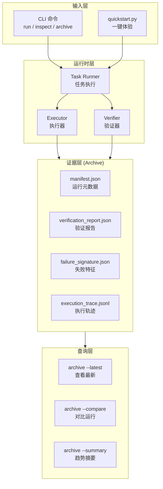
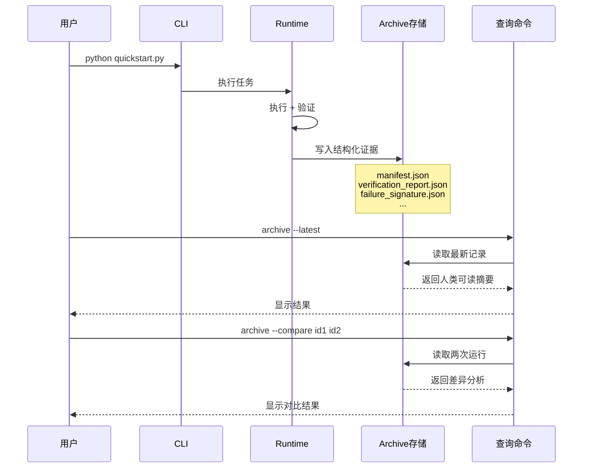
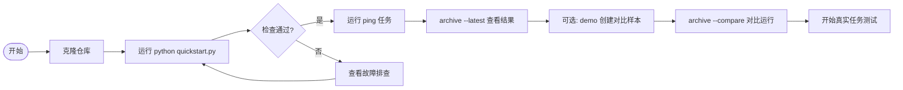
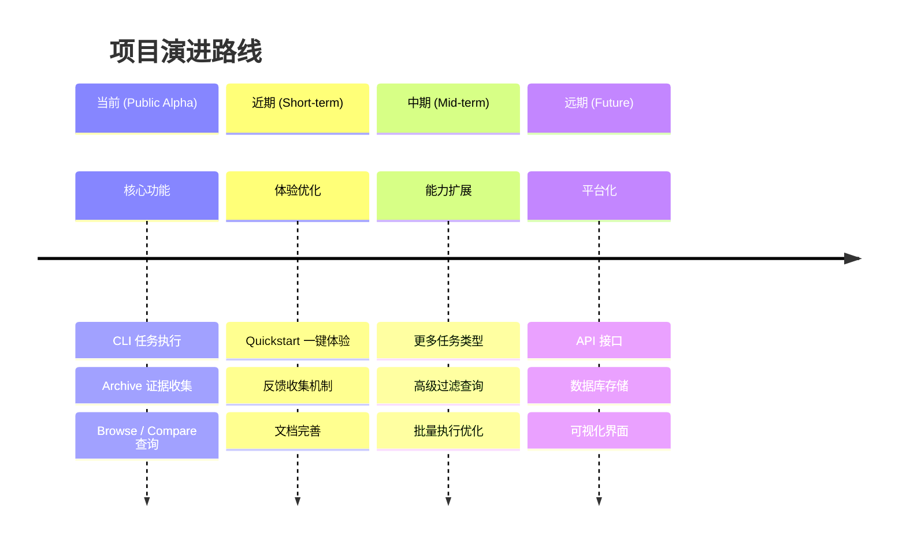
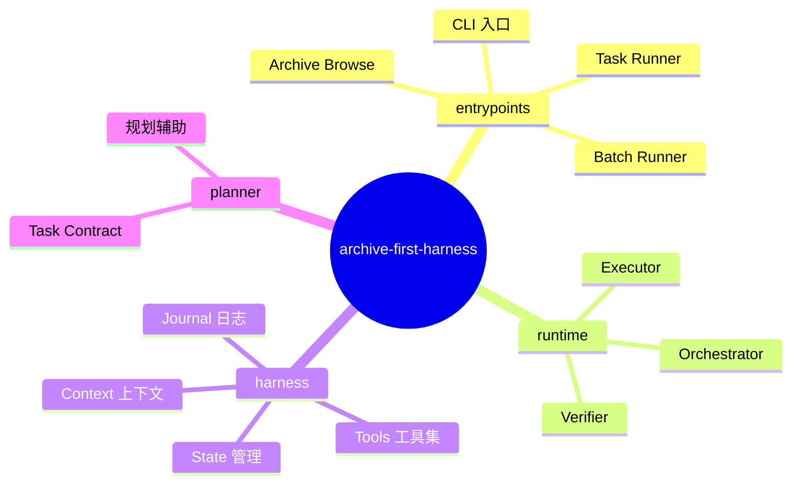
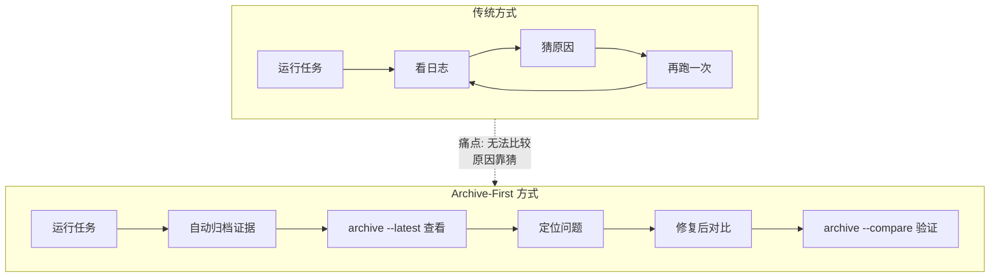

# Archive-First Harness - 核心架构

## 系统架构图

```mermaid
flowchart TB
    subgraph Input["输入层"]
        CLI["CLI 命令\nrun / inspect / archive"]
        Quickstart["quickstart.py\n一键体验"]
    end

    subgraph Runtime["运行时层"]
        Task["Task Runner\n任务执行"]
        Executor["Executor\n执行器"]
        Verifier["Verifier\n验证器"]
    end

    subgraph Evidence["证据层 (Archive)"]
        Manifest["manifest.json\n运行元数据"]
        Report["verification_report.json\n验证报告"]
        Failure["failure_signature.json\n失败特征"]
        Trace["execution_trace.jsonl\n执行轨迹"]
    end

    subgraph Browse["查询层"]
        Latest["archive --latest\n查看最新"]
        Compare["archive --compare\n对比运行"]
        Summary["archive --summary\n趋势摘要"]
    end

    CLI --> Task
    Quickstart --> Task
    Task --> Executor
    Task --> Verifier
    Executor --> Evidence
    Verifier --> Evidence
    Evidence --> Browse
```

## 一次运行的数据流向

```mermaid
sequenceDiagram
    participant User as 用户
    participant CLI as CLI
    participant Runtime as Runtime
    participant Archive as Archive存储
    participant Browse as 查询命令

    User->>CLI: python quickstart.py
    CLI->>Runtime: 执行任务
    Runtime->>Runtime: 执行 + 验证
    Runtime->>Archive: 写入结构化证据
    Note over Archive: manifest.json<br/>verification_report.json<br/>failure_signature.json<br/>...
    User->>Browse: archive --latest
    Browse->>Archive: 读取最新记录
    Archive-->>Browse: 返回人类可读摘要
    Browse-->>User: 显示结果
    User->>Browse: archive --compare id1 id2
    Browse->>Archive: 读取两次运行
    Archive-->>Browse: 返回差异分析
    Browse-->>User: 显示对比结果
```

## 使用流程图

```mermaid
flowchart LR
    Start([开始]) --> Clone[克隆仓库]
    Clone --> Quickstart[运行 python quickstart.py]
    Quickstart --> Check{检查通过?}
    Check -->|是| Ping[运行 ping 任务]
    Check -->|否| Troubleshoot[查看故障排查]
    Troubleshoot --> Quickstart
    Ping --> View[archive --latest 查看结果]
    View --> Demo[可选: demo 创建对比样本]
    Demo --> Compare[archive --compare 对比运行]
    Compare --> Real[开始真实任务测试]
```

## 技术路线图

```mermaid
timeline
    title 项目演进路线
    
    section 当前 (Public Alpha)
        核心功能 : CLI 任务执行
                : Archive 证据收集
                : Browse / Compare 查询
                
    section 近期 (Short-term)
        体验优化 : Quickstart 一键体验
                : 反馈收集机制
                : 文档完善
                
    section 中期 (Mid-term)
        能力扩展 : 更多任务类型
                : 高级过滤查询
                : 批量执行优化
                
    section 远期 (Future)
        平台化 : API 接口
               : 数据库存储
               : 可视化界面
```

## 模块职责图

```mermaid
mindmap
  root((archive-first-harness))
    entrypoints
      CLI 入口
      Task Runner
      Batch Runner
      Archive Browse
    runtime
      Orchestrator
      Executor
      Verifier
    harness
      State 管理
      Context 上下文
      Tools 工具集
      Journal 日志
    planner
      Task Contract
      规划辅助
```

## 对比：传统方式 vs Archive-First

```mermaid
flowchart TB
    subgraph Traditional["传统方式"]
        T1[运行任务] --> T2[看日志]
        T2 --> T3[猜原因]
        T3 --> T4[再跑一次]
        T4 --> T2
    end

    subgraph ArchiveFirst["Archive-First 方式"]
        A1[运行任务] --> A2[自动归档证据]
        A2 --> A3[archive --latest 查看]
        A3 --> A4[定位问题]
        A4 --> A5[修复后对比]
        A5 --> A6[archive --compare 验证]
    end

    Traditional -.->|痛点: 无法比较<br/>原因靠猜| ArchiveFirst
```
